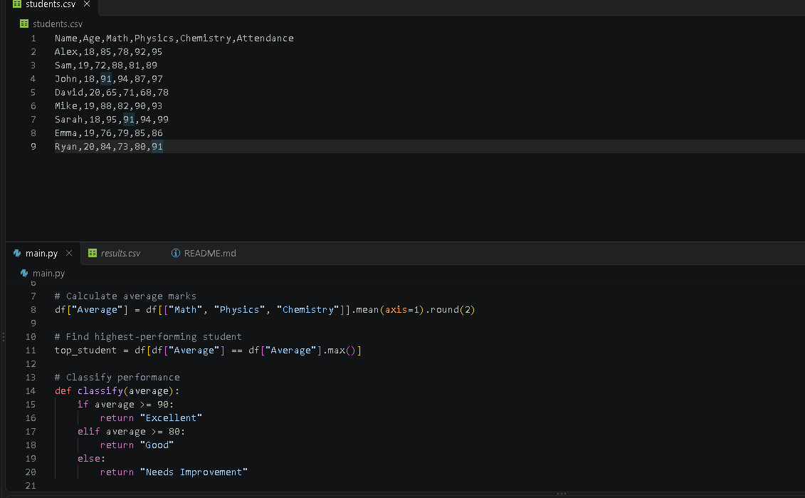
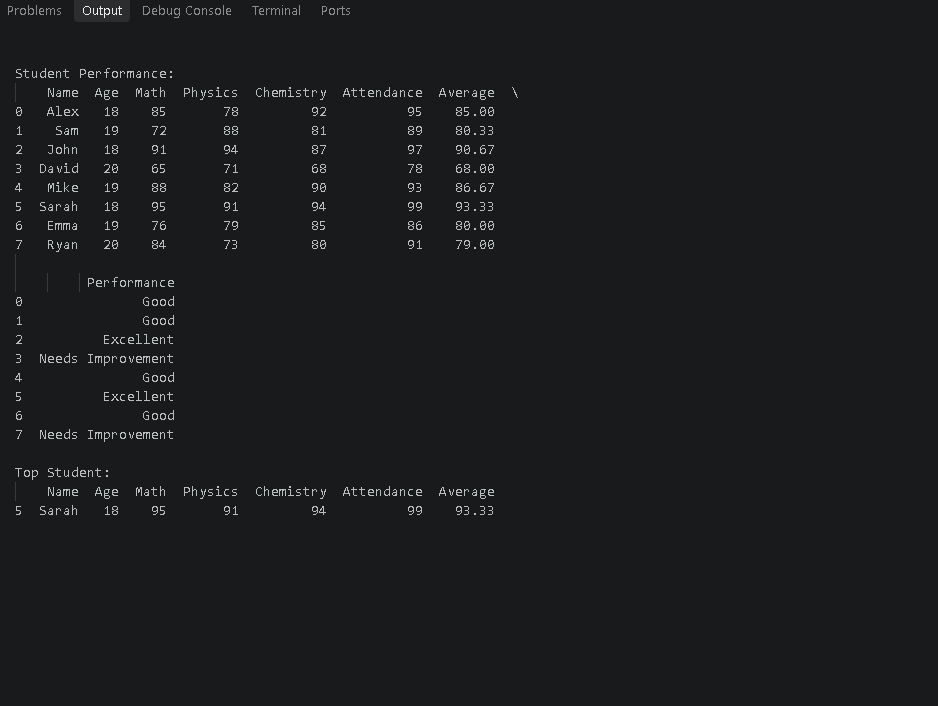

<<<<<<< HEAD
# Student Performance Analyzer

A Python and Pandas project that analyzes student marks, attendance, averages, and overall performance.

## Features

- Calculates average marks
- Finds the top-performing student
- Filters students based on marks and attendance
- Classifies student performance
- Saves the analyzed data to a CSV file

## Technologies Used

- Python
- Pandas
- CSV

## How to Run

1. Install Python.

2. Install Pandas:

pip install pandas

3. Run the program:

python main.py

## Screenshots

### Project



### Output



## What I Learned

Through this project, I learned how to:

- Read CSV data using Pandas
- Work with Pandas DataFrames
- Calculate averages
- Filter and analyze data
- Create performance categories
- Find the highest-performing student
- Save analyzed data to a CSV file

## Future Improvements

- Add data visualizations
- Add more performance statistics
- Improve the user interface
- Explore AI/ML features for student performance analysis
=======
# Student Performance Analyzer
A Python and Pandas project that analyzes student marks, attendance, averages, and overall performance.

## Features

- Calculates average marks
- Finds the top-performing student
- Filters students based on marks and attendance
- Classifies student performance
- Saves the analyzed data to a CSV file

## Technologies Used

- Python
- Pandas
- CSV

## How to Run

1. Install Python.
2. Install Pandas:
   ```bash
   pip install pandas
   ```
3. Run the program:
   ```bash
   python main.py
   ```
>>>>>>> a5646fb0c19618651ba13429de462f7a846f721d
